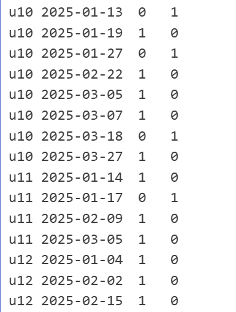
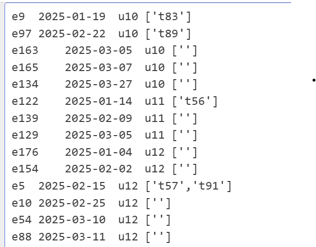

# SQL Assignment Solution by Shivam Jaiswal


### Task 1: Counting Enquiries and Transactions

**My Thought Process:**
1. **Understanding Requirements**:
   - Need separate counts per user per day
   - Cannot use JOIN between tables
   - Must maintain clear structure accoding to expected schema

2. **Solution Design**:
   - Break into two separate counts (enquiries and transactions)
   - Use zero placeholders to maintain consistent columns
   - Combine vertically with UNION ALL
   - Aggregate the combined data

3. **Implementation Steps**:
   ```sql
   -- Step 1: Count enquiries (with txns=0 placeholder)
   -- Step 2: Count transactions (with enqs=0 placeholder)
   -- Step 3: Combine with UNION ALL
   -- Step 4: Sum counts by user and date
   ```

4. **Why This Works**:
   - UNION ALL preserves all records from both tables
   - Zero placeholders ensure correct column structure
   - Final aggregation merges the partial counts

### Task 1: Enquiry and Transaction Counts (Output)



### Task 2: Enquiry Conversion Mapping

**My Thought Process:**
1. **Understanding Requirements**:
   - Link transactions to earliest qualifying enquiry
   - 30-day conversion window
   - Array output format

2. **Solution Design**:
   - Find all valid pairs first
   - Filter to keep only earliest per transaction
   - Group transactions by enquiry
   - Format with arrays

3. **Implementation Steps**:
   ```sql
   -- Step 1: Find all valid pairs (with row numbers)
   -- Step 2: Filter to row_num=1 (earliest enquiry)
   -- Step 3: Group transactions by enquiry
   -- Step 4: Format output with arrays
   ```

4. **Key Insights**:
   - Window functions efficiently handle "earliest" requirement by assigning row number .
   - LEFT JOIN preserves unconverted enquiries
   - ARRAY_AGG creates the required output format


### Task 2: Enquiry Conversion Mapping (Output)



## Assumptions

- All dates use `YYYY-MM-DD` format with no NULL values in the dataset
- Each `enquiry_id` and `txn_id` is unique and non-NULL in its table
- The 30-day window includes the transaction date (Jan 1 - Jan 31 counts as 30 days)
- If a user has no enquiries on a date, `count_enqs` shows 0 and vice-versa.
- Task 2 links transactions only to the earliest qualifying enquiry.
- A transaction can only be linked to **one** enquiry, but one enquiry can be linked to **multiple** transactions(One to Many relationship).
